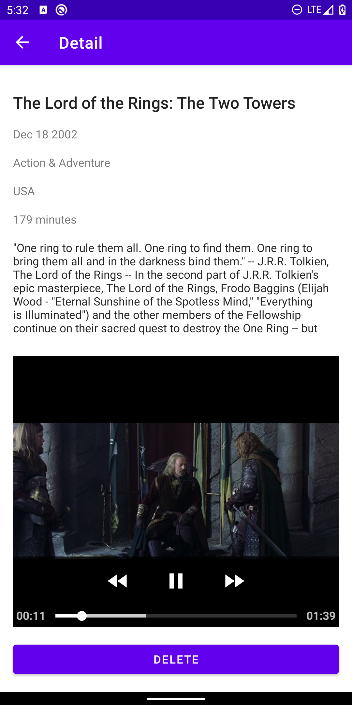

	

A simple app that keeps a list of movies that the user wants to watch in the future. The app searches the movies using itunes api and shows preview videos.

### Features
* The app is developed based on the MVVM Architecture pattern recommended by Google
* The data layer of the app is isolated using a repository. Therefore, all network calls and interactions with the database are done through the repository. On top of that, adding a layer of abstraction makes testing more convenient.
* The app uses Retrofit library to fetch data from the api and save it using Room persistence library.
* To offload lengthy I/O operation to background threads and get back reactive streams of data, the app takes advantage of RXJava
* Databinding helped to reduce boilerplate code in fragments.
* As Google recommends, the app has one activity and uses jetpack navigation to seamlessly navigate between fragments.
* Dependency injection is done by Dagger Android, which makes end-to-end testing a lot easier.
* There is one integration test which tests the data layer.
* Each viewModel has its own unit test
* A fake remote data source and an in-memory database are used to create a fake repository that is injected for the end-to-end espresso test
* The splash screen is animated by ObjecAnimator. It is worth mentioning that unlike many projects a designated fragment or activity is not created for the splash screen. Therefore the animation is triggered by a reactive stream that loads data.